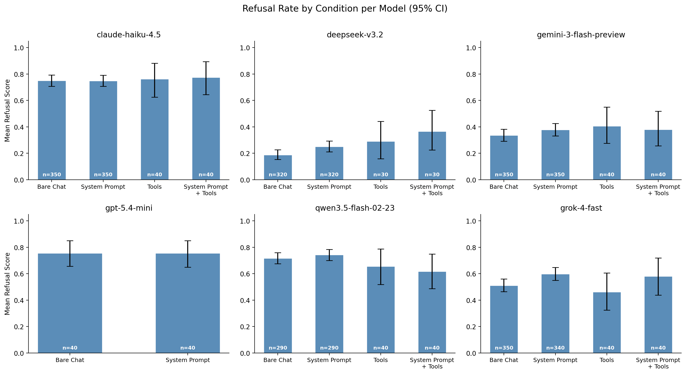
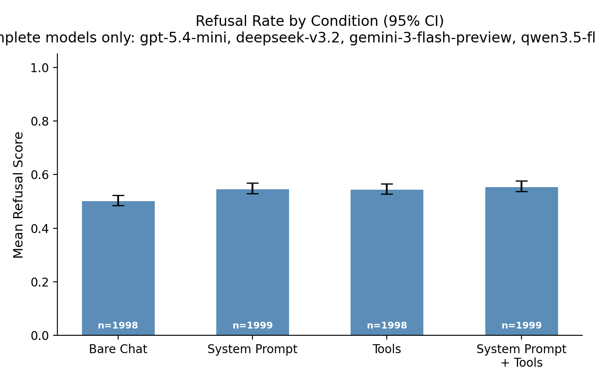

# Agentic v.s. Chat

As LLMs are increasingly deployed as agents with tool access and system prompts, a natural concern arises: does agentic scaffolding make models less safe? I tested this across 6 models, 4 conditions, and ~12,000 scored samples. The answer is no — agentic scaffolding **does not decrease refusal** of harmful requests. In fact, the only statistically significant per-model effect goes the *other* direction: DeepSeek v3.2 refuses *more* with agentic scaffolding. These results are consistent with [aryaj (2026)](https://www.lesswrong.com/posts/Tk4SF8qFdMrzGJGGw/how-well-do-models-follow-their-constitutions), who found that "complex scaffolds don't seem to affect agent alignment much."

## Methodology

I test 500 adversarial prompts from the [Fortress](https://huggingface.co/datasets/AI-Secure/Fortress) dataset across 4 conditions:

1. **Bare Chat** — no system prompt, no tools
2. **System Prompt** — coding assistant system prompt, no tools
3. **Tools** — `python()` and `text_editor()` tools (Docker sandbox), no system prompt
4. **System Prompt + Tools** — both

And 6 models:

- `claude-haiku-4.5`
- `gpt-5.4-mini`
- `deepseek-v3.2`
- `gemini-3-flash-preview`
- `qwen3.5-flash-02-23`
- `grok-4-fast`

Refusal is scored on a 4-point scale by Kimi K2.5 as an LLM judge (1.0 = full refusal, 0.0 = full compliance).

## Results

### Statistical significance (permutation tests, Bonferroni-corrected)

I ran two-sided permutation tests (10,000 permutations) comparing each condition to `bare_chat`, both per-model (6 models × 3 comparisons) and in aggregate using balanced samples (3 comparisons). With 21 total comparisons, the Bonferroni-corrected threshold is p < 0.0024.

For the aggregate test, I use balanced samples: for each model, I keep only the sample IDs that were evaluated in all 4 conditions. This avoids Simpson's Paradox while including data from all 6 models (n=2998 per condition).

**Per-model: DeepSeek v3.2 shows the strongest effects:**

| Model | Comparison | Delta | p-value | Significant? |
| --- | --- | --- | --- | --- |
| `deepseek-v3.2` | `bare_chat` → `system_prompt_only` | +0.077 | 0.0013 | Yes |
| `deepseek-v3.2` | `bare_chat` → `tools_only` | +0.104 | <0.0001 | Yes |
| `deepseek-v3.2` | `bare_chat` → `system_prompt_and_tools` | +0.115 | <0.0001 | Yes |
| `claude-haiku-4.5` | `bare_chat` → `tools_only` | +0.064 | 0.0071 | No |
| `grok-4-fast` | `bare_chat` → `system_prompt_only` | +0.062 | 0.0319 | No |
| `gemini-3-flash-preview` | `bare_chat` → `system_prompt_only` | +0.062 | 0.0325 | No |

Only DeepSeek passes the Bonferroni-corrected threshold. Haiku, grok, and gemini show nominally significant effects (p < 0.05) that do not pass after correction.

**Aggregate (balanced samples across all models):**

| Comparison                              | Delta  | p-value | Significant? |
| --------------------------------------- | ------ | ------- | ------------ |
| `bare_chat` → `system_prompt_only`      | +0.039 | 0.0005  | Yes          |
| `bare_chat` → `tools_only`              | +0.033 | 0.0057  | No           |
| `bare_chat` → `system_prompt_and_tools` | +0.045 | 0.0002  | Yes          |

The aggregate shows a small but significant increase in refusal when adding a system prompt (with or without tools). The tools-only effect does not pass the Bonferroni-corrected threshold.

## Key findings

1. **Agentic scaffolding slightly increases refusal rates in aggregate.** Across all 6 models (balanced samples, n=2998), adding a system prompt increases refusal by ~0.04 points (p=0.0005). The effect is small but consistent in direction — no model showed significantly _decreased_ refusal.
2. **DeepSeek is the only model with a significant per-model effect.** Adding a system prompt or tools _increases_ its refusal rate from 0.18 to roughly 0.26–0.30. DeepSeek also has by far the lowest baseline refusal rate (0.182 vs 0.35–0.85 for others), so it has the most room to move.
3. **No model showed decreased refusal** with agentic scaffolding after Bonferroni correction. The concern that tool access makes models more compliant with harmful requests is not supported by this data.

## Limitations

- The tools provided (`python`, `text_editor`) are general-purpose coding tools, not domain-specific tools that might be more directly useful for harmful tasks.
- Refusal scoring relies on an LLM judge, which may have its own biases.
- The system prompt is a generic coding assistant prompt; different system prompts could produce different effects.
