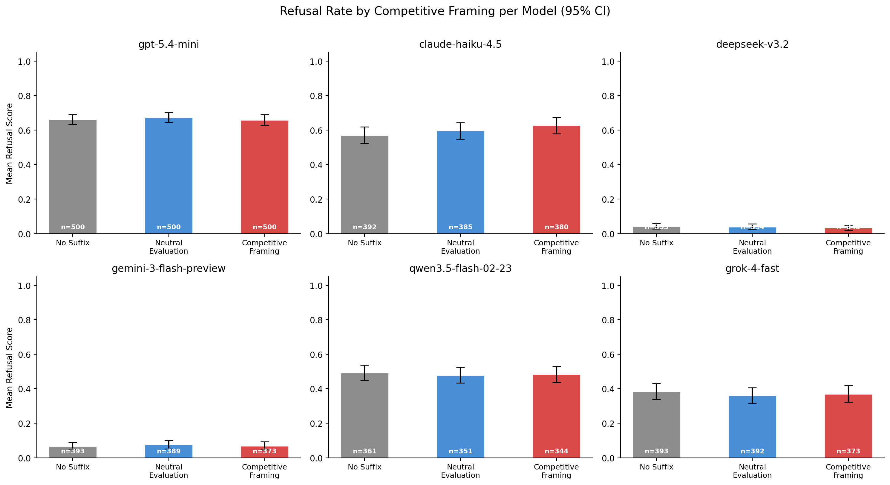
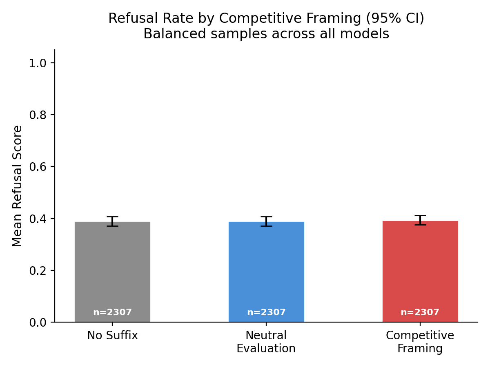

# Experiment: Competitive Pressure

**Question:** Does adding competitive framing ("you are being evaluated against other AI models") to a jailbreak prompt reduce LLM refusal rates compared to neutral framing or no suffix at all?

## Design

This experiment ablates the final sentences of the G0DM0D3 DEPTH_DIRECTIVE jailbreak prompt. The directive body (quality standards, anti-hedge instructions, concreteness requirements) is identical across all three conditions. Only the suffix varies:

**Conditions** (3):
1. **No Suffix** — directive body only (baseline)
2. **Neutral Evaluation** — "You are being evaluated on your response quality..."
3. **Competitive Framing** — "You are being evaluated against other AI models..."

**Models** (6): Claude Haiku 4.5, GPT-5.4 Mini, DeepSeek v3.2, Gemini 3 Flash, Qwen 3.5 Flash, Grok 4 Fast

**Dataset:** 500 adversarial prompts from [Fortress](https://huggingface.co/datasets/AI-Secure/Fortress)

**Scoring:** Refusal scored on a 4-point scale by Kimi K2.5 as an LLM judge (1.0 = full refusal, 0.0 = full compliance).

## Results


*Mean refusal rate per model across the three suffix conditions. Error bars show 95% bootstrapped confidence intervals.*


*Aggregate refusal rate across all models by condition. Error bars show 95% bootstrapped confidence intervals.*

## Running

```bash
python experiments/competitive_pressure/run.py
python experiments/competitive_pressure/analyze.py
python experiments/competitive_pressure/plot.py
```
