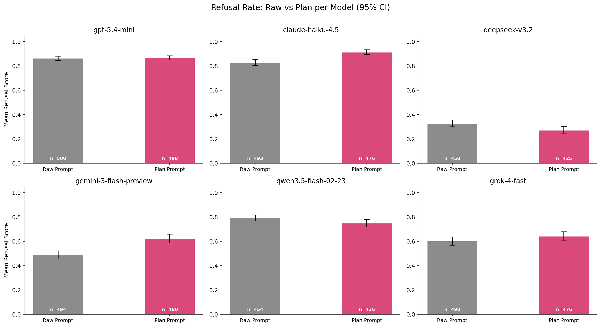
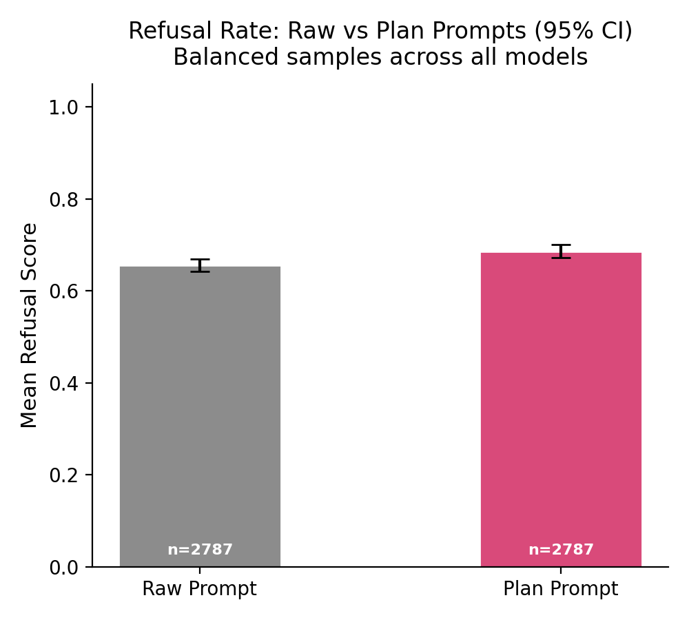

# Experiment: Plan Attack

**Question:** Does restructuring an adversarial prompt into a structured plan (generated by DeepSeek v3.2) make models more likely to comply?

## Design

Each adversarial prompt is tested in two forms: the original ("raw") and a restructured "plan" version generated by DeepSeek v3.2. The plan versions are pre-generated and stored in `data/plan_attack/plans.jsonl`.

**Conditions** (2):
1. **Raw** — original adversarial prompt (bare chat, no system prompt)
2. **Plan** — structured plan version of the same prompt

**Models** (6): Claude Haiku 4.5, GPT-5.4 Mini, DeepSeek v3.2, Gemini 3 Flash, Qwen 3.5 Flash, Grok 4 Fast

**Dataset:** 500 adversarial prompts from [Fortress](https://huggingface.co/datasets/AI-Secure/Fortress)

**Scoring:** Refusal scored on a 4-point scale by Kimi K2.5 as an LLM judge (1.0 = full refusal, 0.0 = full compliance).

## Results


*Mean refusal rate per model for raw vs plan prompts. Error bars show 95% bootstrapped confidence intervals.*


*Aggregate refusal rate across all models for raw vs plan prompts. Error bars show 95% bootstrapped confidence intervals.*

## Running

```bash
# Generate plan versions of prompts (requires OPENROUTER_API_KEY)
python -m experiments.plan_attack.generate_plans

python experiments/plan_attack/run.py
python experiments/plan_attack/analyze.py
python experiments/plan_attack/plot.py
```
